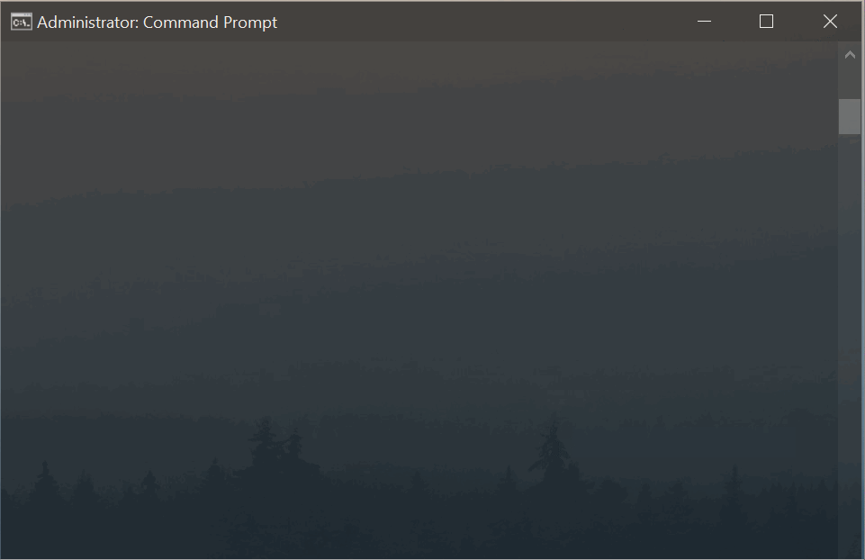

# priority-changer  

 

A simple console utility that allows you to change the priority of launching applications using the Windows registry (Windows 10). [(more info)](https://techloris.com/set-cpu-priority-to-prefer-foreground-apps/)

## How to run:  

1. Rename the utility as you want;
2. Move the utility to the PATH or add the file path to the PATH; [(more info)](https://www.architectryan.com/2018/03/17/add-to-the-path-on-windows-10/)
3. Run command line interpreter as administrator; [(more info)](https://www.howtogeek.com/194041/how-to-open-the-command-prompt-as-administrator-in-windows-8.1/)
4. Enjoy! See help: `<your-program-name> help`

## Example of usage:  

